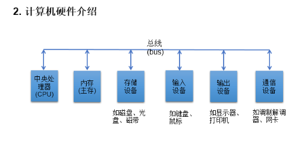

# 1.计算机概述
计算机=hardware   +  software
software提供指令---控制硬件--使得硬件完成特定的任务

程序设计语言：
工具， 软件开发engineer  利用语言工具   --创建软件

语言有优缺点，重点是利用哪种语言来“解决实际问题”
***

***

***
##### CPU
cpu构建在一块小的硅半导体芯片上，其中包含数百万个“晶体管”的小电路开关上， 以处理信息。

***
##### 存储设备
内存：RAM（Random Access Memory)
###1.保存从硬盘中读取的数据，提供给CPU使用
###2.保存CPU的一些临时执行结果，以便CPU下次使用或保存到硬盘

硬盘技术：ROM（Read Only Memory)
***
人机交互方式
1. 图形化界面（Graphical User Interface GUI)
2. 命令行方式（Command Line Interface CLI)

***
Pascal之父Nicklaus Wirth: "Programs = Algorithms + Data Structures"
***
##### 常用的DOS命令
* dir
* md: 创建目录
* rd: 删除空目录[del 目录：删除目录下的文件，再rd 删除目录]
* cd\: 退回到根目录
* del: 删除文件
* exit
* echo 追加文字信息（echo name:Tom>1.txt）即创建文本记录name:Tom