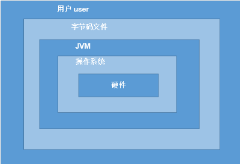

# 1.Java语言特点

##### ①面向对象
	两个基本概念：类、对象
	三大特性： 封装、继承、多态
##### ②健壮性
	吸收C/C++的优点，去掉了部分（指针、内存的申请和释放等），提供了一个相对安全的内存管理和访问机制
##### ③跨平台性
	Write once, Run Anywhere
	原理：不同的操作系统上安装有不同的JVM（Java Virtual Machine)以运行同一份Java程序
***
#### 2.Java语言运行机制
1. Java虚拟机JVM

2. 垃圾收集机制（GC：Garbage Collection)  
内存溢出：栈容器已存满，再存则溢出
内存泄露：本该被清理的内存，GC时被判断为不该回收，后续又不再调用这个内存，即泄露