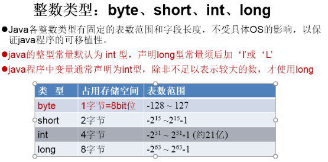

# 3.变量
**概念：**
内存中的一个存储区域
该区域的数据可以在同一类型范围内不断变化
变量是程序中最基本存储单元，变量类型，变量名 和 值

**作用：**
用于在内存中保存数据

**注意**：
1. 先声明，后使用（使用之前需赋值）
2. 初始化值（声明并赋值）
3. 作用域：{}
4. 同一个作用域中，不可重名
5. 使用变量名来 访问这块区域中的数据
***
##### 分类-按数据类型

**整型变量**：

**浮点类型：**

**字符型**

***
##### 分类-安装声明的位置的不同
