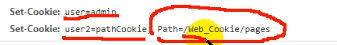

# 1.Cookie简介
HTTP请求是无状态的，服务器不知道请求是谁发起的


要有状态，必须使用 <font color=tomato size=4>**会话控制**</font>
①Cookie  ②Session
:::alert-danger
cookie对象的名字(key)不能使用中文;
value可以中文,但是必须指定字符集编码,获取时指定字符集解码
:::
:::alert-light
##### <font color=tomato>关于Cookie</font>


————————————————

       

```text
cookie的运行原理：
  1.第一次向服务器发送请求时  在服务器端创建一个Cookie对象
  2.将Cookie对象发送给浏览器
  3.以后浏览器再发请求会携带该Cookie对象
  4.服务器根据不同的Cookie对象来区分不同的用户
```

:::


:::alert-info
不创建cookie时：

创建cookie时：

↓
↓


***
创建两个cookie，第二个cookie的有效路径不是默认的根路径而是/pages
此时，再次访问根目录(首页), 就不会携带cookie2



:::
