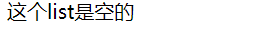

# 3.empty标签
:::alert-light
```jsp
<%--  empty运算符：
      主要用来判断一个字符串 或者 一个集合是否为空
      非空：   empty前加一个"!"  或者  加一个"not"
--%>

(当前pageScope域对象中并没有setAttribute() list这个key：value)
  <c:if test="${empty list}">  
    这个list是空的
  </c:if>

```
页面显示结果：
:::alert-info  


:::