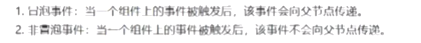

# 7.事件机制-响应用户交互
事件机制，主要用于对用户交互操作行为进行响应

是 视图层 向 逻辑层进行数据交互的一种方式

***
之前案例中，视图层定义的按钮绑定的事件是  在其所在页面对应的js页面对象中定义的

用户点击按钮时，
会触发一个tap事件，
然后框架会将事件发生的相关信息封装到一个事件对象中，
将事件对象传递给js中绑定的事件函数`f0`
***
###### 除了通过`bindtap`进行绑定，还可以用 `catchtap`

***
###### `catchtap`和`bindtap`的区别
bindtap会向上传递给父元素
当前冒泡元素不会阻止自己的冒泡事件向上传递；

触发button会调用绑定的事件函数，
同时会传递给父元素 （例如：view）

**而**
而如果不需要传递给父/祖先元素处理做进一步的处理，当前元素自己处理就用`catchtap`

**target:** 指定的事件真正触发的源头元素（例如：image元素），
**currentTarget:** 绑定事件的元素(例如：view父元素)

### 案例：
swiper幻灯片中其它页面点击 `本周推荐`跳转到指定页面

在每一个tap事件绑定的函数`f0`中进行定义
让currentIndex = 指定页面的页码

 

